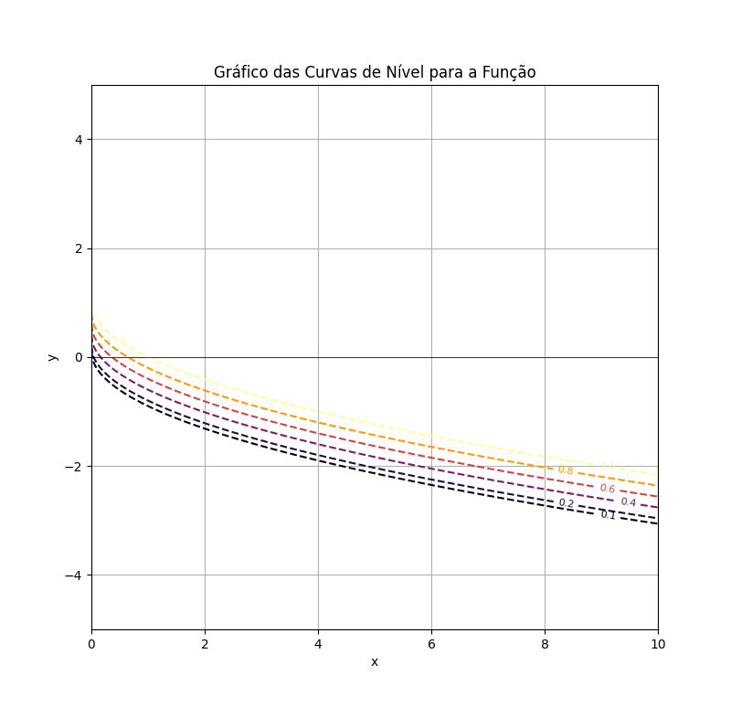

## GLC - Generator Level Curves



> GLC is a Python project aimed at constructing contour maps or level curves of a function with two or more variables. The project was inspired by exercises from a Calculus III course on partial derivatives. It is implemented in a straightforward manner to facilitate visualization.

### Adjustments and Improvements

O projeto ainda está em desenvolvimento e as próximas atualizações serão voltadas para as seguintes tarefas:

- [x] 2D views of Levels Curves and customization
- [x] 2D and 3D views of Levels Curves and Customization
- [x] Interactive 3D graphs of Levels Curves.
- [ ] More customization, more interactive, more informations of equation using and calculus working for surfaces3 3D: grad, deriavate parcial etc.


## Requiriments

Antes de começar, verifique se você atendeu aos seguintes requisitos:

- You have installed the latest version of `python, numpy, sympy and matplotlib`
- You have a `Win/Linux/Mac` machine.

##  Installing GLC - Generator Levels Curves.

For installing the project, follow these steps:

1. Clone the repository:
    ```bash
    git clone https://github.com/wnods/GLC.git
    ```
2. Navigate to the project directory:
    ```bash
    cd GLC
    ```
3. Install dependencies:
    ```bash
    pip install -r requirements.txt
    ```

## How its Works
- Run the script to generate and visualize the level curves:
- When you launch the code in the terminal or IDE of your choice, it will welcome you and give you the option to make your graph.
- By choosing your function that depends on x and y to form the contour line where z = k. You will plot contour line graphs in a given range that can be modified in the code "LC-2D.py","Surface3D.py" or "Intsurf3D.py".

## 2D Graphs of Levels Curves:
- São gráficos plotados diretamente por uma função de x e y onde z = k. Essas curvas de níveis nós dar informação 2D de uma superfície 3D.

    
  

