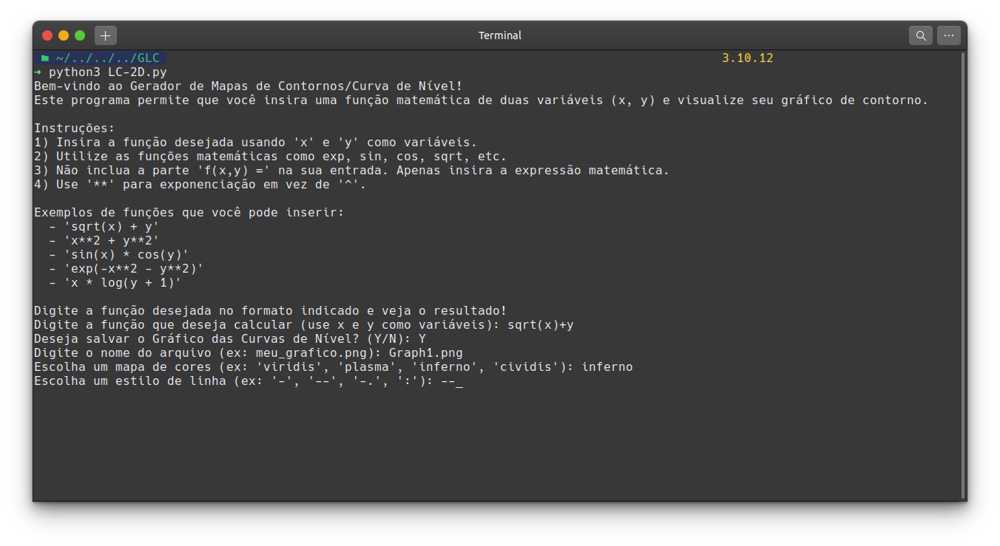

## GLC - Generator Level Curves


> GLC is a Python project aimed at constructing contour maps or level curves of a function with two or more variables. The project was inspired by exercises from a Calculus III course on partial derivatives. It is implemented in a straightforward manner to facilitate visualization.

### Adjustments and Improvements

The project is still under development and the next updates will focus on the following tasks:

- [x] 2D views of Levels Curves and customization
- [x] 2D and 3D views of Levels Curves and Customization
- [x] Interactive 3D graphs of Levels Curves.
- [ ] More customization, more interactive, more informations of equation using and calculus working for surfaces3 3D: grad, deriavate parcial etc.


## Requiriments

Before you begin, make sure you meet the following requirements:

- You have installed the latest version of `python, numpy, sympy and matplotlib`
- You have a `Win/Linux/Mac` machine.

##  Installing GLC - Generator Levels Curves.

For installing the project, follow these steps:

1. Clone the repository:
    ```bash
    git clone https://github.com/wnods/GLC.git
    ```
2. Navigate to the project directory:
    ```bash
    cd GLC
    ```
3. Install dependencies:
    ```bash
    pip install -r requirements.txt
    ```

## How its Works
- Run the script to generate and visualize the level curves:
- When you launch the code in the terminal or IDE of your choice, it will welcome you and give you the option to make your graph.
- By choosing your function that depends on x and y to form the contour line where z = k. You will plot contour line graphs in a given range that can be modified in the code "LC-2D.py","Surface3D.py" or "Intsurf3D.py".

# Example:



## 2D Graphs of Levels Curves:
- They are graphs plotted directly by a function of x and y where z = k. These contour lines give us 2D information of a 3D surface.

    

 > The function that represents the figure is the egg box function: sin(x) - sin(y).

## 3D Surface and 2D Levels Curves.

- They are graphs plotted directly by a function of x, y, z or z = k. These func give us a 3D surface and your 2D levels curves.

      

   > This function creates a surface that looks like a "saddle", where the curvature is positive along one direction and negative along the other. The functions is: z = (x**2 - y**2)

## 3D Interactive Surfaces

- They give us a 3D surface in Browser. This allows us to know the minimum and maximum points, and view the contour lines using sliders on the surfaces we choose. With this, we can have precise limits and trends for the surface in question.

   

  > The 3D surfaces that represents the figure is the egg box function: sin(x) - sin(y).
  

